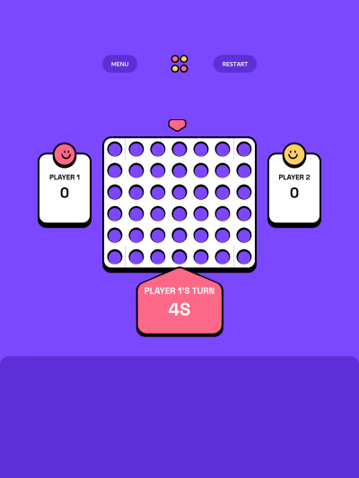

# Frontend Mentor - Connect Four game solution

This is a solution to the [Connect Four game challenge on Frontend Mentor](https://www.frontendmentor.io/challenges/connect-four-game-6G8QVH923s). Frontend Mentor challenges help you improve your coding skills by building realistic projects.

## Table of contents

- [Overview](#overview)
  - [The challenge](#the-challenge)
  - [Screenshot](#screenshot)
  - [Links](#links)
- [My process](#my-process)
  - [Built with](#built-with)
  - [What I learned](#what-i-learned)
  - [Continued development](#continued-development)
  - [Useful resources](#useful-resources)
- [Author](#author)
- [Acknowledgments](#acknowledgments)

## Overview
The goal of the game is to connect four discs vertically, horizontally or diagonally
and the first to do it wins

### The challenge

Users should be able to:

- View the game rules
- Play a game of Connect Four against another human player (alternating turns on the same computer)
- View the optimal layout for the interface depending on their device's screen size
- See hover and focus states for all interactive elements on the page
- **Bonus**: See the discs animate into their position when a move is made
- **Bonus**: Play against the computer

### Screenshot



### Links

- Solution URL: [The github repository](https://github.com/jay-ike/connect-four-game)
- Live Site URL: [The Live version](https://jay-ike.github.io/connect-four-game)

## My process

### Built with

- Semantic HTML5 markup
- CSS custom properties
- CSS Mask
- CSS Grid
- Mobile-first workflow
- Custom Event for reactivity

### What I learned

In terms of css we can create a custom shape with the help of clip-path and svg
or with the help of mask-image (which can take any image even css gradients)
```css
.pawn::before {
    -webkit-mask-image: radial-gradient(circle, transparent 50%, black 0);
    mask-image: radial-gradient(circle, transparent 50%, black 0);
}
/*this was used to create the hole in the grid items of each disc*/
```
In tems of javascript we can use Custom Event to notify DOM nodes
```js
        function notify(time) {
            const timeUpdated = new CustomEvent("timeupdated", {
                detail: {time}
            });
            node.dispatchEvent(timeUpdated);
        };
```

### Continued development

Next I should implement the play vs CPU feature to make it more pleasing

### Useful resources

- [The Mozilla developer network](https://developer.mozilla.com) - This helped me to strengthen my knowlegde of DOM scripting

## Author
- Frontend Mentor - [@jay-ike](https://www.frontendmentor.io/profile/jay-ike)
- Twitter - [@jospinEvans](https://www.twitter.com/jospinEvans)

## Acknowledgments
I was highly inspired by this solution to check a win in the connect-four game so feel free to check here in case you whant to take a look
PS: The code is written in python
[The stackexchange community for code review](https://codereview.stackexchange.com/questions/112948/checking-for-a-win-in-connect-four)
